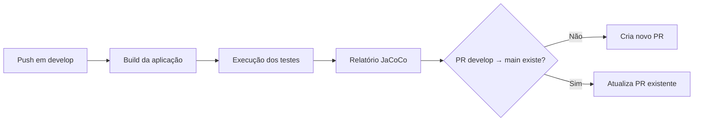

# Java TodoList API Template v1

API RESTful de gerenciamento de tarefas (Todo List) construída com **Java 25** e **Spring Boot 3.5.15**, seguindo os princípios de Clean Architecture com separação em camadas bem definidas.

---

## 🚀 Tecnologias

| Tecnologia | Versão | Descrição |
|---|---|---|
| Java | 21 | Linguagem de programação |
| Spring Boot | 3.5.15 | Framework principal |
| Spring JDBC | — | Acesso a banco de dados relacional |
| MySQL Connector | 9.2.0 | Driver de conexão com MySQL |
| ModelMapper | 2.4.4 | Mapeamento entre objetos |
| SpringDoc OpenAPI | 2.6.0 | Documentação Swagger/OpenAPI |
| Jackson | — | Serialização/deserialização JSON |
| Logback | — | Sistema de logging estruturado |
| Spring Actuator | — | Monitoramento e health checks |
| JaCoCo | 0.8.15 | Relatório de cobertura de testes |
| LogCaptor | 2.9.3 | Captura de logs em testes unitários |

---

## 🏗️ Arquitetura

O projeto segue uma arquitetura em camadas inspirada em **Clean Architecture**, com as seguintes divisões:

```
src/main/java/com/mycompany/javatodolistapitemplatev1/
│
├── domain/                         # Entidades de domínio
│   ├── common/
│   │   └── BaseEntity.java
│   └── entities/
│       └── Todo.java
│
├── application/                    # Regras de negócio e casos de uso
│   ├── dtos/
│   │   ├── requests/               # DTOs de entrada
│   │   ├── responses/              # DTOs de saída
│   │   └── wrappers/               # Wrappers de resposta (paginação)
│   ├── exceptions/
│   │   └── AppException.java
│   ├── interfaces/
│   │   ├── repositories/           # Contratos de repositórios
│   │   └── useCases/               # Contratos de casos de uso
│   ├── mappers/                    # Mapeadores entre DTOs e entidades
│   └── usecases/                   # Implementações dos casos de uso
│       ├── CreateTodoUseCase.java
│       ├── DeleteTodoUseCase.java
│       ├── GetTodoUseCase.java
│       ├── GetTodoListUseCase.java
│       ├── GetPaginatedTodoListsUseCase.java
│       ├── UpdateTodoUseCase.java
│       └── SetDoneTodoUseCase.java
│
├── infrastructure/                 # Implementações de infra (banco de dados)
│   └── persistence/
│       └── repositories/
│           └── TodoRepositoryAsync.java
│
├── presentation/                   # Controllers, filtros e interceptors
│   ├── controllers/
│   │   ├── HomeController.java
│   │   └── v1/
│   │       └── TodoController.java
│   ├── filters/
│   │   └── ErrorHandlerFilter.java
│   └── interceptors/
│       ├── CorrelationIdInterceptor.java
│       └── NotificationContextInterceptor.java
│
└── shared/                         # Componentes compartilhados
    ├── notification/               # Padrão de notificação de domínio
    │   ├── abstractions/
    │   ├── contexts/
    │   ├── interfaces/
    │   └── models/
    └── utils/
        └── MsgUltil.java
```

---

## 📡 Endpoints da API

Base URL: `http://localhost:8080/api/v1/todo`

| Método | Endpoint | Descrição | Status de Sucesso |
|---|---|---|---|
| `GET` | `/api/v1/todo/` | Lista todas as tarefas | `200 OK` |
| `GET` | `/api/v1/todo?page_number=1&page_size=10` | Lista tarefas paginadas | `200 OK` |
| `GET` | `/api/v1/todo/{id}` | Busca uma tarefa por ID | `200 OK` |
| `POST` | `/api/v1/todo` | Cria uma nova tarefa | `201 Created` |
| `PUT` | `/api/v1/todo/{id}` | Atualiza uma tarefa existente | `200 OK` |
| `PATCH` | `/api/v1/todo/{id}` | Marca/desmarca uma tarefa como concluída | `200 OK` |
| `DELETE` | `/api/v1/todo/{id}` | Remove uma tarefa | `204 No Content` |

### Respostas de Erro

Todos os endpoints retornam respostas de erro padronizadas:

| Código | Descrição |
|---|---|
| `400` | Bad Request — dados inválidos ou regra de negócio violada |
| `404` | Not Found — recurso não encontrado |
| `500` | Internal Server Error — erro interno da aplicação |

---

## 🗄️ Banco de Dados

A aplicação utiliza **MySQL** com acesso via Spring JDBC (sem ORM). As operações no repositório são realizadas de forma assíncrona usando `CompletableFuture`.

### Configuração padrão (`application.yml`)

```yaml
spring:
  datasource:
    url: jdbc:mysql://127.0.0.1:3306/todolistdb
    username: root
    password: pwdmysql
    driver-class-name: com.mysql.cj.jdbc.Driver
```

### Estrutura da tabela `todo`

```sql
CREATE TABLE todolistdb.todo (
    id    BIGINT AUTO_INCREMENT PRIMARY KEY,
    title VARCHAR(255) NOT NULL,
    done  BOOLEAN      NOT NULL DEFAULT FALSE
);
```

---

## ⚙️ Configurações de Paginação

```yaml
paginationSettings:
  maxPageSize: 50
  defaultPageSize: 10
  initialPagination: 1
```

---

## 🩺 Monitoramento (Actuator)

Os seguintes endpoints de monitoramento estão disponíveis:

| Endpoint | Descrição |
|---|---|
| `GET /actuator/health` | Status de saúde da aplicação |
| `GET /actuator/info` | Informações da aplicação |

---

## 📖 Documentação da API (Swagger)

Com a aplicação em execução, acesse a documentação interativa via Swagger UI:

```
http://localhost:8080/swagger-ui/index.html
```

---

## 🔧 Como executar

### Pré-requisitos

- Java 25+
- Maven 3.8+
- MySQL em execução na porta `3306`

### Executando localmente

```bash
# Clone o repositório
git clone https://github.com/eusouleoandrade/java-todolist-api-template-v1.git

# Entre no diretório do projeto
cd java-todolist-api-template-v1/java-todolist-api-template-v1

# Build do projeto
./mvnw clean package

# Execute a aplicação
./mvnw spring-boot:run
```

---

## 🧪 Testes

O projeto possui uma suíte de testes abrangente cobrindo todas as camadas da aplicação:

```bash
# Executar todos os testes
./mvnw test

# Executar testes com relatório de cobertura JaCoCo
./mvnw clean test jacoco:report
```

### Resultados da última execução

```
Tests run: 241, Failures: 0, Errors: 0, Skipped: 0
BUILD SUCCESS
```

### Cobertura de Testes (JaCoCo)

> 📄 Veja o [Relatório Completo de Cobertura](java-todolist-api-template-v1/target/site/jacoco/index.html) gerado pelo JaCoCo (disponível após executar `./mvnw clean test jacoco:report`).

| Métrica | Resultado |
|---|---|
| ✅ Cobertura de Instruções | **100%** |
| ✅ Cobertura de Branches | **100%** |
| ✅ Cobertura de Métodos | **100%** |
| ✅ Cobertura de Linhas | **100%** |
| ✅ Classes Testadas | **49 / 49** |
| ✅ Testes Executados | **241** |

---

## 🔄 CI/CD (GitHub Actions)

O projeto conta com um pipeline de **Integração Contínua** configurado em [`.github/workflows/continuous_integration.yml`](.github/workflows/continuous_integration.yml), que é acionado a cada push na branch `develop`.

### Etapas do pipeline



| Job | Descrição |
|---|---|
| `BuildAndTestApplication` | Compila, testa e gera o relatório de cobertura |
| `CreatePullRequest` | Cria ou atualiza automaticamente um PR de `develop` para `main` |

---

## 📝 Logging

A aplicação utiliza **Logback** com logging estruturado. Cada requisição é rastreada por um `correlationId` único, injetado pelo `CorrelationIdInterceptor`, permitindo rastreabilidade ponta-a-ponta nos logs.

---

## 📌 Padrão de Notificação

A aplicação implementa o **Notification Pattern** para gerenciar erros de domínio de forma não-disruptiva (sem lançar exceções para erros de negócio). As notificações são acumuladas durante o processamento e retornadas na resposta HTTP de forma padronizada.

---

## 📂 Estrutura do Repositório

```
java-todolist-api-template-v1/
├── .github/
│   └── workflows/
│       └── continuous_integration.yml   # Pipeline de CI/CD
├── java-todolist-api-template-v1/       # Módulo principal da aplicação
│   ├── src/
│   │   ├── main/                        # Código-fonte principal
│   │   └── test/                        # Testes unitários e de integração
│   └── pom.xml                          # Dependências e configurações Maven
└── README.md
```
